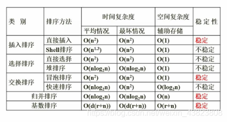

# 1. 数据结构定义
数据结构是指数据元素集合及元素间相互作用和构造方法。元素之间的相互关系是数据的逻辑结构，元素与元素之间的存储关系为物理结构。

# 2. 数组

# 3. 稀疏矩阵

# 4. 线性表

## 4.1 顺序表和链表

## 4.2 顺序存储和链式存储

## 4.3 栈与队列

## 4.4 广义表

元素个数：单个元素、子表数量
深度：括号层数
表头：第一个元素
表尾：除第一个元素外

# 5. 树与二叉树

## 5.1 基本概念
- 节点的度：当前节点的孩子节点的个数
- 树的度：树中所有节点的度最大那个
- 叶子节点：度为0

## 5.2 二叉树重要性质
- 第i层有2^(i-1)个节点
- 深度为k的二叉树最多有(2^k)-1个节点
- 具有n个结点的完全二叉树的深度为：「log2n」+ 1

## 5.3 二叉树的遍历
- 先序遍历
- 中序遍历
- 后序遍历
- 层次遍历

## 5.4 二叉查找树（二叉排序树）
- 左孩子小于根
- 右孩子大于根

## 5.5 最优二叉树（哈夫曼树）
构造最短带权路径。从上往下权值增加，因此需要从下往上拼凑权值低的。
`左0右1`

## 5.6 线索二叉树
节省存储空间，若结点有左子树，则LChild指向左孩子，否则指向前驱结点；
若有右子树，则RChild指向右孩子，否则指向后继结点。
线索二叉树前驱后继分析，先用相应遍历，然后根据上面两个规则找出。

## 5.7 平衡二叉树
- 任意结点的左右子树深度相差不超过1
- 每个结点的平衡度只能为-1、0、1

# 6. 图

## 6.1 基本概念
- 完全图：每对顶点有线相联
- 有向图：每队顶点有两条有向边

## 6.2 图的存储

### 6.2.1 邻接矩阵
用1表示i到j有邻接边。

### 6.2.2 邻接表
使用链的形式，将顶点的邻接点表示出来，然后用数组将头指针装起来

## 6.3 图的遍历
- 深度优先
- 广度优先

## 6.4 拓扑排序
拓扑序列不唯一。
- 每次选择一个入度为0的删除，最终得到一个拓扑序列

## 6.5 最小生成树

### 6.5.1 普里姆算法 -- 以顶点为中心，适合稠密图
每次根据已走的顶点，选择最小边。且不能生成环路

### 6.5.2 克鲁斯科尔算法 -- 以边为中心，适合稀疏图
每一步寻找边最小。

# 7. 排序与查找

## 7.1 查找

### 7.1.1 顺序查找、二分查找

- 顺序查找
  - 平均查找长度（ASL），（n+1）/2
- 二分查找
  - 平均查找长度（ASL），(log2n)+1
  - 时间复杂度，log2n

### 7.1.2 散列表-哈希查找

## 7.2 排序

### 7.2.1 直接插入排序
即当插入第i个记录时，假设前面i-1个元素是已经排序好的，只要找个位置将i元素插入，且将需要移动的元素移动好就可以了。

### 7.2.2 希尔排序
使用一个整数d（一般是用数组长度n/2取奇数），然后按步长获取分组内容进行排序。

### 7.2.3 简单选择排序
每次选择一个最大的放在最后，一个个选

### 7.2.4 堆排序
建堆，然后每次删除大顶堆的根节点，然后重新建堆，重复
大顶堆：根节点都比儿子节点的数值要大

### 7.2.5 冒泡排序
通过相邻元素比较和交换，将较大元素逐渐往后面挪

### 7.2.6 快速排序
找出基准，将排序数组分成左边比基准小，右边比基准大，然后重复在左右数组做同样的操作

### 7.2.7 归并排序
将两个或以上有序的数组合并成一个。

# 8. 算法

## 8.1 算法的特性
- 有穷性： 执行有穷步之后结束
- 稳定性：算法的每一条智力高都必须有确切的含义
- 输入大于0
- 输出大于1
- 有效性：