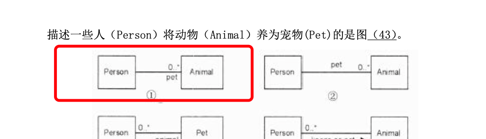
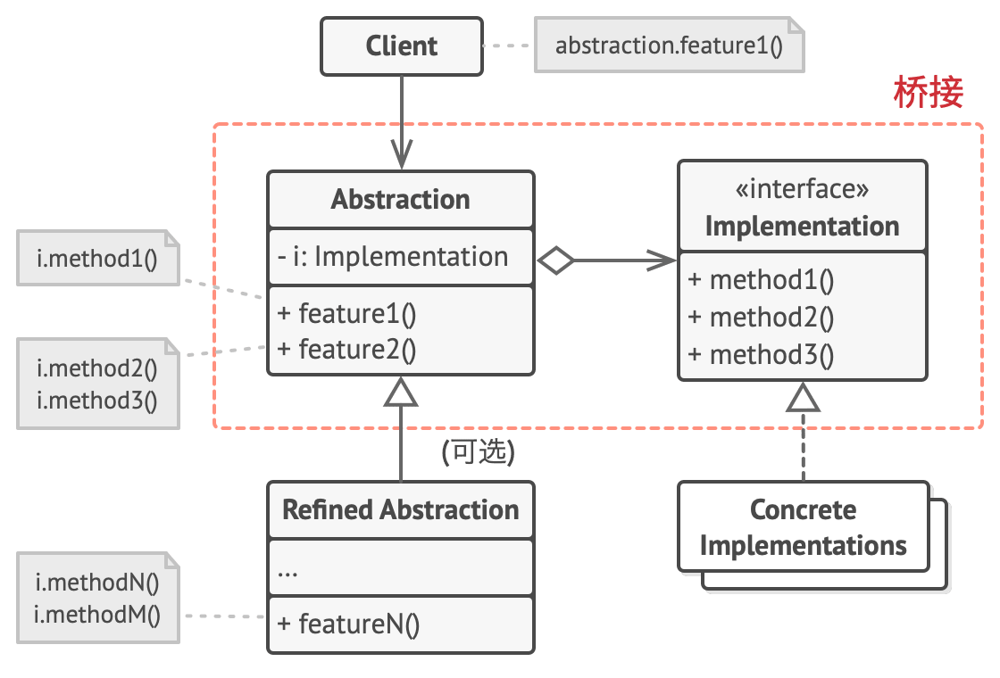

# 1 6.面向对象技术

## 1.1 基本概念
- 对象
- 类
- 抽象
- 继承与泛化
- 多态
  - 参数
  - 包含，同样的操作可以用于一个类型及其子类型
  - 过载，同一个名可以再上下文又不一样的类型
  - 强制，强制转换
- 接口
- 消息
- 组件
- 模式和复用

面向对象分析时，执行的活动顺序是，认定对象，组织对象，描述对象的相互作用，确定对象的操作，定义对象的内部信息。

## 1.1 设计原则
- 单一职责原则：设计目的单一的类，要修改一个类的时候，应该只因为一个目的
- 开放-封闭原则：对扩展开放、对修改封闭
- 李氏替换原则：子类可以替换父类
- 依赖倒置原则：要依赖于抽象，而不是具体实现；针对接口编程，不要针对实现编程
- 接口隔离原则：使用多个专门的接口比使用单一的总接口要好
- 组合重用、聚合原则：要尽量使用组合，而不是继承关系达到重用目的
- 迪米特原则：一个对象应当对其他对象尽可能少了解
- 共同变化：  包内一个东西变化，只对保内影响，不对其他有影响

# 2 UML

## 2.1 UML中的四种关系
- 依赖关系：依赖是两个事物间的语义关系，其中一个事物发生变化会影响另一个事物。图上用一个有方向的虚线
- 关联关系：关联是一种结构关系，描述一组链。聚合：描述整体和部分的结构关系。组合，同样也是。
- 泛化关系：特殊元素（子元素）的对象可替代一般元素（父元素）的对象。
- 实现关系：实现类元之间的语义关系。

<<<<<<< HEAD

## 2.2 UML中的结构图（静态）

### 2.2.1 类图
类图展现了一组对象、接口、协作和他们之间的关系。类图给出系统的静态设计视图。、

=======

## 2.2 UML中的结构图（静态）

### 2.2.1 类图
类图展现了一组对象、接口、协作和他们之间的关系。类图给出系统的静态设计视图。、

>>>>>>> 20bdfc8d60e012ea30f9a8a09efcb08a46eaf34a

### 2.2.2 对象图
对象图展示某一时刻一组对象以及他们之间的关系。

### 2.2.3 包图
包图是用于把模型本身组织成层次结构的通用机制，不能执行，展现由模型本身分解而成的组织单元以及其间的依赖关系。

### 2.2.4 组合结构图
描述一个分类器的内部结构，展示一组相互协作的实例如何完成特定的任务。

### 2.2.5 构件图
构件图展现了一组构建组件的组合和依赖。

- 半圆表示需要
- 圆表示提供

### 2.2.6 部署图
用来对6.面向对象系统的物理方面建模

## 2.3 UML中的行为图（动态）

### 2.3.1 用例图
展示一组用例、参与者以及他们之间的关系

### 2.3.2 顺序图（序列图）
场景的图形化表示，描述以时间顺序组织的对象之间的交互活动

### 2.3.3 通信图（协作图）
强调收发消息的对象的结构组织

### 2.3.4 定时图
适合实时和嵌入式系统建模交互

### 2.3.5 状态图
强调对象行为的时间顺序
状态图用于描述对象、子系统、系统的生命周日。通过状态图可以了解一个对象所能达到的所有状态以及对象收到事件对对象状态的影响。

### 2.3.6 活动图
展示系统内从一个活动到另以个活动的流程

### 2.3.7 交互概览图
描述业务过程中控制流的概述

## 3 设计模式

### 3.1 设计模式概念
- 架构模式：软件设计中高层决策，例如C/S结构。架构模式反映了开发软件系统过程中所作的基本设计决策。
- 设计模式：关注软件系统的设计

### 3.2 设计模式分类
- 创建型模式
- 结构型模型
- 行为型模式

### 3.3 创建型模式

#### 3.3.1 抽象工厂模式
<<<<<<< HEAD

=======

>>>>>>> 20bdfc8d60e012ea30f9a8a09efcb08a46eaf34a
意图：提供一个创建一系列相关或相互依赖对象的接口，而无需指定他们具体的类。通常可由多组工厂方法实现。
定义工厂接口和产品接口，以产品分类或变形来区分实现种类，在不同工厂实体中实现工厂接口实现针对性提供产品。

#### 3.3.2 构建器、生成器模式
意图：将一个复杂对象的构建与它的表示分离，使得同样的构建过程可以创建不同的表示。
可以定义一系列接口，分解创建步骤。

#### 3.3.3 工厂方法模式
<<<<<<< HEAD

=======

>>>>>>> 20bdfc8d60e012ea30f9a8a09efcb08a46eaf34a
意图：定义一个用于创建对象的接口，让子类决定实例化哪一个类(抽象产品)。
只定义了工厂接口和产品接口，具体创建推迟到子类的实现，子类决定实例化对象类型

#### 3.3.4 原型模式
意图：用原型实例指定创建对象的种类，并且通过复制这些原型创建新的对象，无需代码依赖他们所属的类。

即复制对象的时候，需要先新建一个对象，然后复制里面的属性，但是有些内容可能是私有的。所以外部复制并非总是可行

实现copy

#### 3.3.5 单例模式
意图：保证一个类仅有一个实例，并提供一个访问它全局的访问点

### 3.4 结构性模式

#### 3.4.1 适配器模式
<<<<<<< HEAD

=======

>>>>>>> 20bdfc8d60e012ea30f9a8a09efcb08a46eaf34a
意图：将一个类的接口转换成客户希望的另一个接口。使得原本由于接口不兼容而不能一起工作的那些类可以一起工作。
定义

#### 3.4.2 桥接模式
<<<<<<< HEAD

=======

>>>>>>> 20bdfc8d60e012ea30f9a8a09efcb08a46eaf34a
例子：不同形状不同颜色的图形；遥控器和不同电子设备；
意图：将`抽象部分与其实现部分`抽离，使他们可以独立的变化。
通过将继承改为组合的方式，抽取其中一个因素作为独立的类，其他因素添加到抽取的独立类中。

- 抽象部分： 定义给高层使用的接口，里面调用具体实现部分接口，不需要外部知道
- 实现部分： 定义提供给抽象部分调用的接口，由实现部分具体实现功能。

#### 3.4.3 组合模式

例子：树的结构
意图：将对象组合成树形结构以表示“部分-整体”的层次结构，使得用户对单个对象和组合对象的使用具有一致性。
声明接口，然后让简单元素和复杂元素实现，在复杂元素中拥有一个数组，存储着简单元素。树的结构。

#### 3.4.4 装饰模式（封装器）

例子:套娃
意图：动态给一个对象添加一些额外的职责。
定义一个组件接口，并对业务组件实现组件接口。创建装饰基类，其中需要一个成员变量指向需要被封装的业务组件（实现了组件接口的），

#### 3.4.5 外观模式
例子：打电话去订货。订货后面处理由不同服务商搞掂。
意图：为子系统中的一组接口提供一个一致的界面。定义了一个高层接口，这个接口使得这一子系统更加容易使用。（复杂内容提供简单接口，隐藏内部细节）
重新定一个一个类，把需要用的逻辑扔进去，用一个方法装起来

#### 3.4.6 享元模式
例子：将子弹做成一个不变的实例，不用每次创建。
意图：运用共享技术有效地支持大量细粒度的对象。
提取出内存或时间消耗大的部分，作为内在状态，构造的时候将内在状态和外在变化状态合并，重新组成原来的内容。同时可以增加缓存机制。

#### 3.4.7 代理模式
<<<<<<< HEAD

=======

>>>>>>> 20bdfc8d60e012ea30f9a8a09efcb08a46eaf34a
意图：为其他对象提供一种代理以控制对这个对象的访问。
新建一个代理对象提供同样要封装对象的接口，且持有需要封装的对象。

### 3.5 行为型模式

#### 3.5.1 责任链模式

意图：使多个对象都有机会处理请求，从而避免请求的发送者和接受者之间的耦合关系。将这些对象连城一条链，并沿着这条链传递该请求，直到有一个对象处理它位置。
声明一个接口，接口拥有一个同类型的成员，且有一个处理方法。处理方法必须判断自身能否实现，和传递给下一个对象处理。

#### 3.5.1 命令模式

例子：餐厅下单，waiter传递订单（命令）到后厨，
意图：将请求封装为一个对象，从而使得可以用不同的请求对客户进行参数化；对请求排队或记录请求日志，以及支持可撤销的操作。

#### 3.5.1 解释器模式

意图：给定一个语言，定义他的文法的一种表示，并定义一个解释器，这个解释器使用该表示来解释语言中的句子。

#### 3.5.1 迭代器模式
<<<<<<< HEAD

=======

>>>>>>> 20bdfc8d60e012ea30f9a8a09efcb08a46eaf34a
意图：提供一种方法顺序访问一个聚合对象中的各个元素，且不需要暴露该对象的内部表示。
声明迭代器接口，提供需要的迭代方法。声明迭代集合接口，并具有迭代器成员。

#### 3.5.1 中介者模式
<<<<<<< HEAD

=======

>>>>>>> 20bdfc8d60e012ea30f9a8a09efcb08a46eaf34a
例子：飞机控制塔台
意图：用一个中介对象来封装一系列的对象交互。使各对象不需要显式地相互引用，从而使耦合松散，而且可以独立地改变他们之间的交互。

#### 3.5.1 备忘率模式
<<<<<<< HEAD

=======

>>>>>>> 20bdfc8d60e012ea30f9a8a09efcb08a46eaf34a
意图：允许在不暴露对象实现细节的情况下保存和恢复对象之前的状态。
由对外封闭的对象，内部提供生成状态接口的对象内容，保留封闭对象的独立

#### 3.5.1 观察者模式

意图：定义对象间一种一对多的依赖关系，当一个对象状态发生变化改变时，所有依赖于它的对象的状态都能得到通知。

#### 3.5.1 状态模式

意图：允许一个对象在其内部状态改变时改变它的行为。

#### 3.5.1 策略模式

例子：实现加减乘除，通过定义同一个接口，让不同类实现，分别加减乘除，使用的时候调用不同的类里面同样的接口方法即可。
意图：定义一系列算法，把他们一个个封装起来，并且使他们可以相互替换。
抽象出业务中某个逻辑功能存在变体的部分，声明该逻辑中通用的接口，将各个功能实现抽取出来，实现策略接口，然后在上下文类中，添加一个成员变量保存策略对象的引用。

#### 3.5.1 模板模式
意图：在父类中定义了算法的框架，且允许子类不修改结构的情况下，对局部方法进行自定义。

#### 3.5.1 访问者模式
意图：将算法与其作用的对象隔离开。
实现：使用一个visitor，声明所有可能访问的element方法，然后声明一个element接口，就是accept一个visitor，然后在实际accept方法中，调用visitor相对应的visit方法，然后visit方法就会调用各自element的算法。很绕，但是为了将不同element在同一个地方展示，即将算法和element抽象，然后将visitor复杂化，声明应对不同element算法的接口，然后只需要将不同element accept visitor即可以。