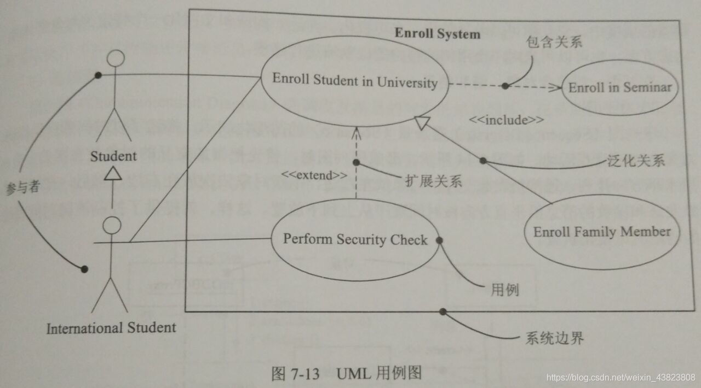
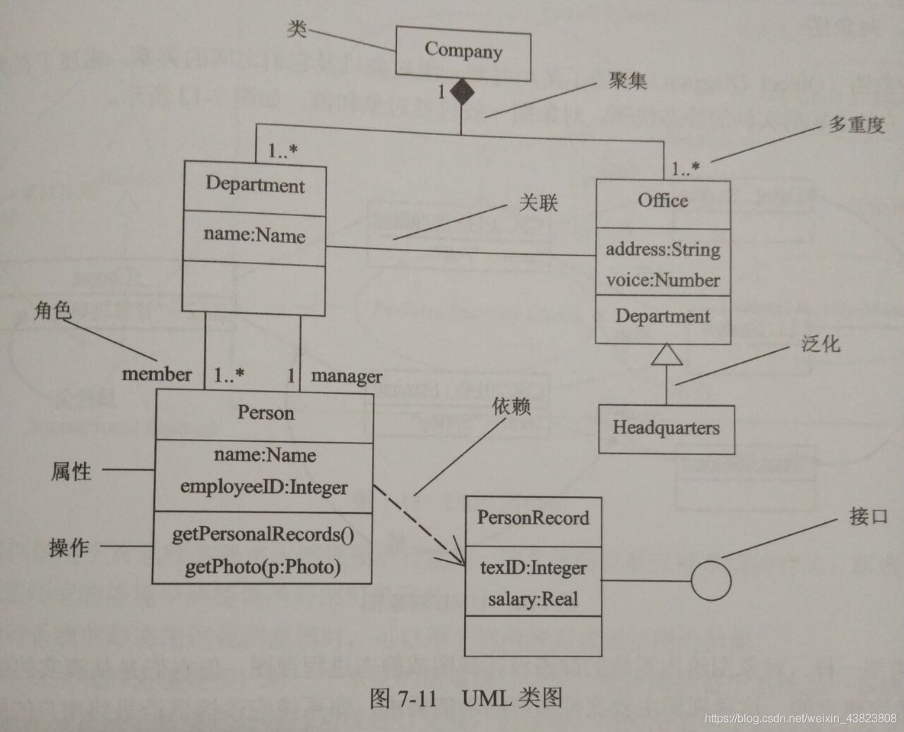
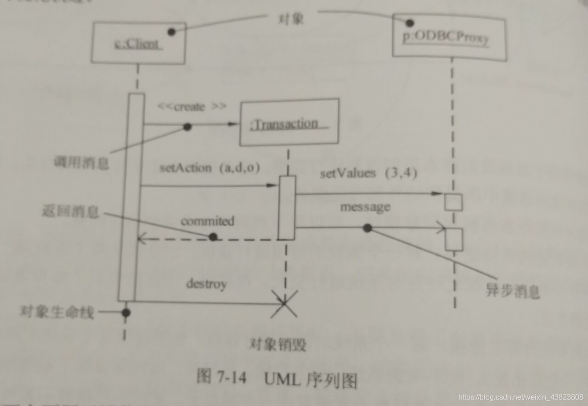
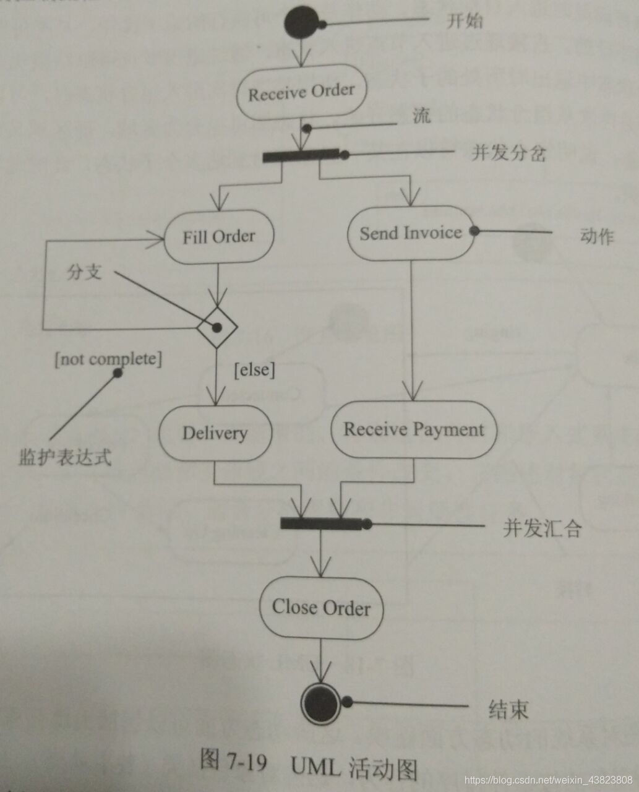
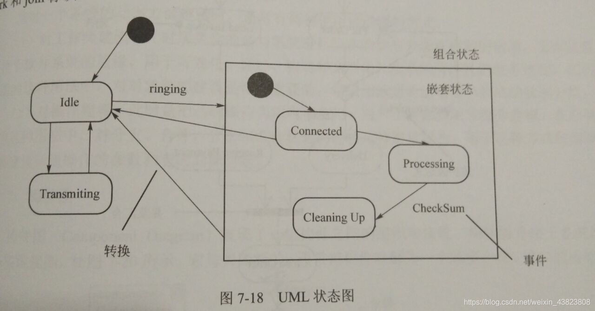
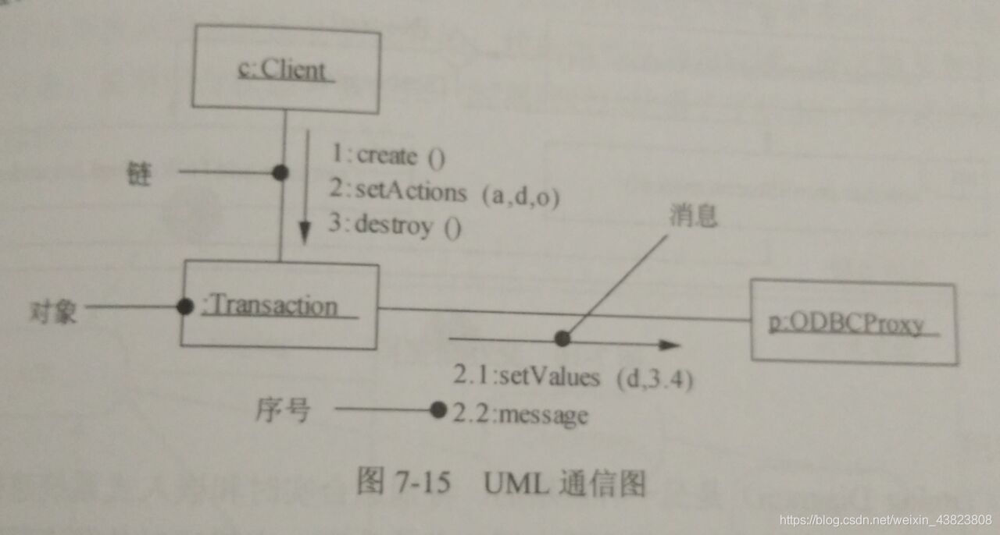

- 用例图
- 类图与对象图
- 顺序图
- 活动图
- 状态图
- 通信图
- 构件图

# 用例图

## 考察内容
1. 基本是给出详细描述和用例图，将参与者和用例扣掉，
2. 考察两个用例之间的关系

## 考察关系
- 包含关系:使用`inlcude`关键字，
- 泛化关系
- 扩展关系:使用`extend`关键字，

# 类图与对象图

## 考察内容
1. `填类名`，方法名，属性名
2. `填多重度`
3. `填关系`

## 多重度
- 1：表示1个集合的一个对象对应另一个集合中1个对象
- 0..*:表示一个对应0个或多个
- 1..*:表示一个对应1个或多个
- *:表示一个对应多个

## 考察关系

- 依赖关系
- 泛化关系
- 关联关系（菱形代表整体部分）
  - 组合关系
  - 聚合关系
- 实现关系

## 解题
1. 寻找描述中、类图中寻找关系（关键）
   1. 寻找代表性的

# 顺序图

对象在顶部，每个对象有一个虚线的生命线，从上到下。
表达消息的传递，表示流程执行对象，什么对象进行什么操作。

## 考察 --- `消息`
根据题目，一步一步下来，把某些消息扣掉，依据处理流程上，

# 活动图

表现整个处理流程基本情况，分支的状态。

# 状态图

状态的变迁

## 解题
先识别有多少个状态，列出一个状态到另一个状态需要多少条件

# 通信图

和顺序图就差时间顺序没有表达的那么直观。