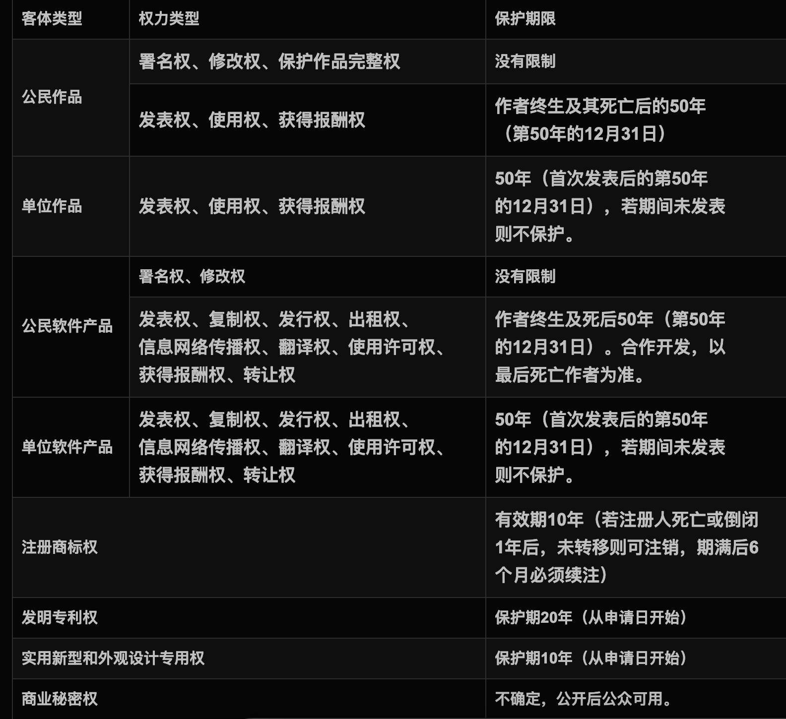
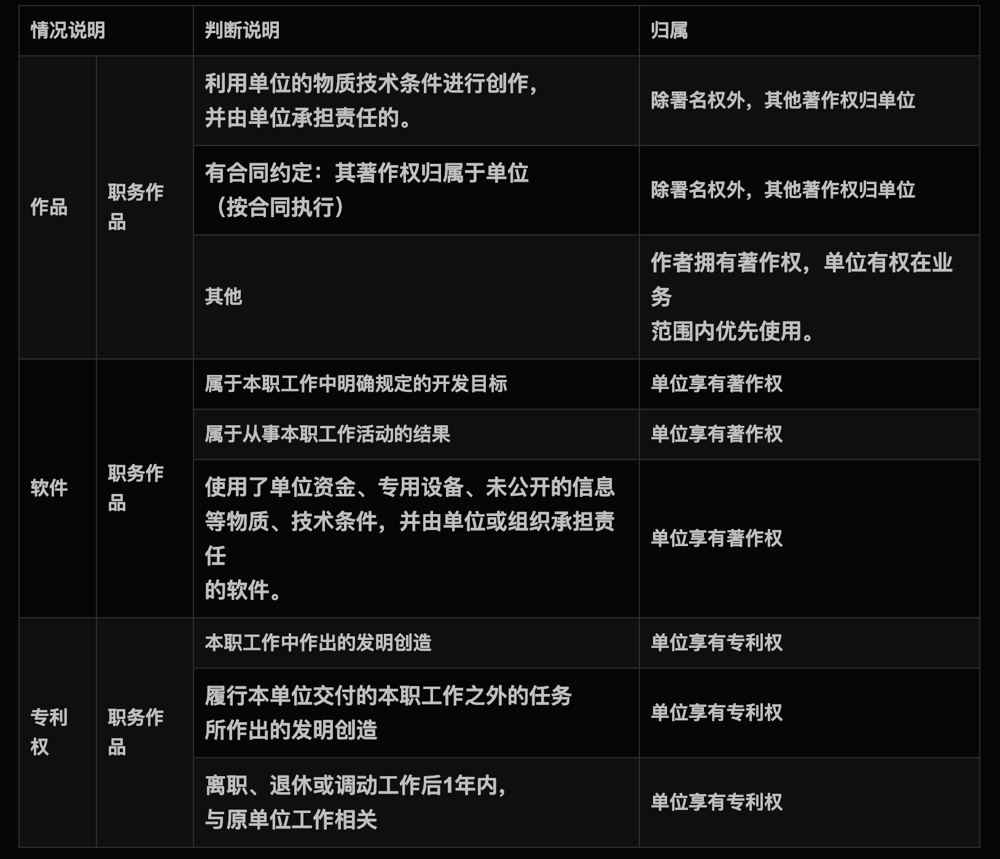
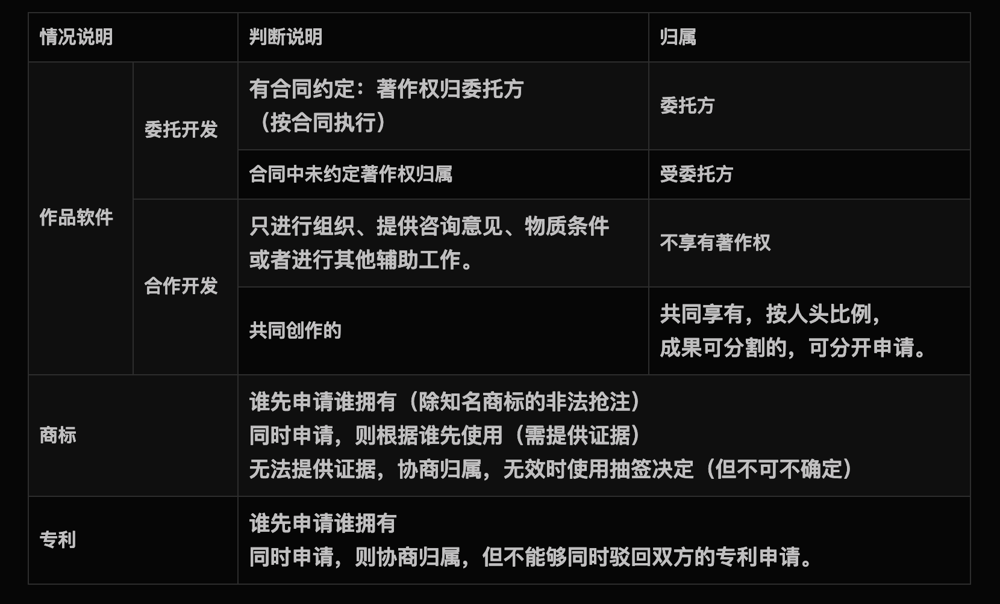
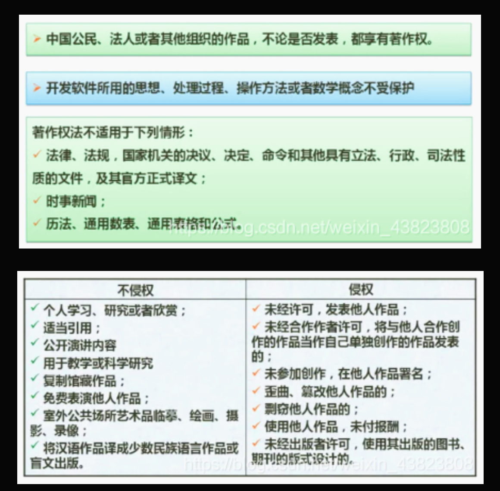
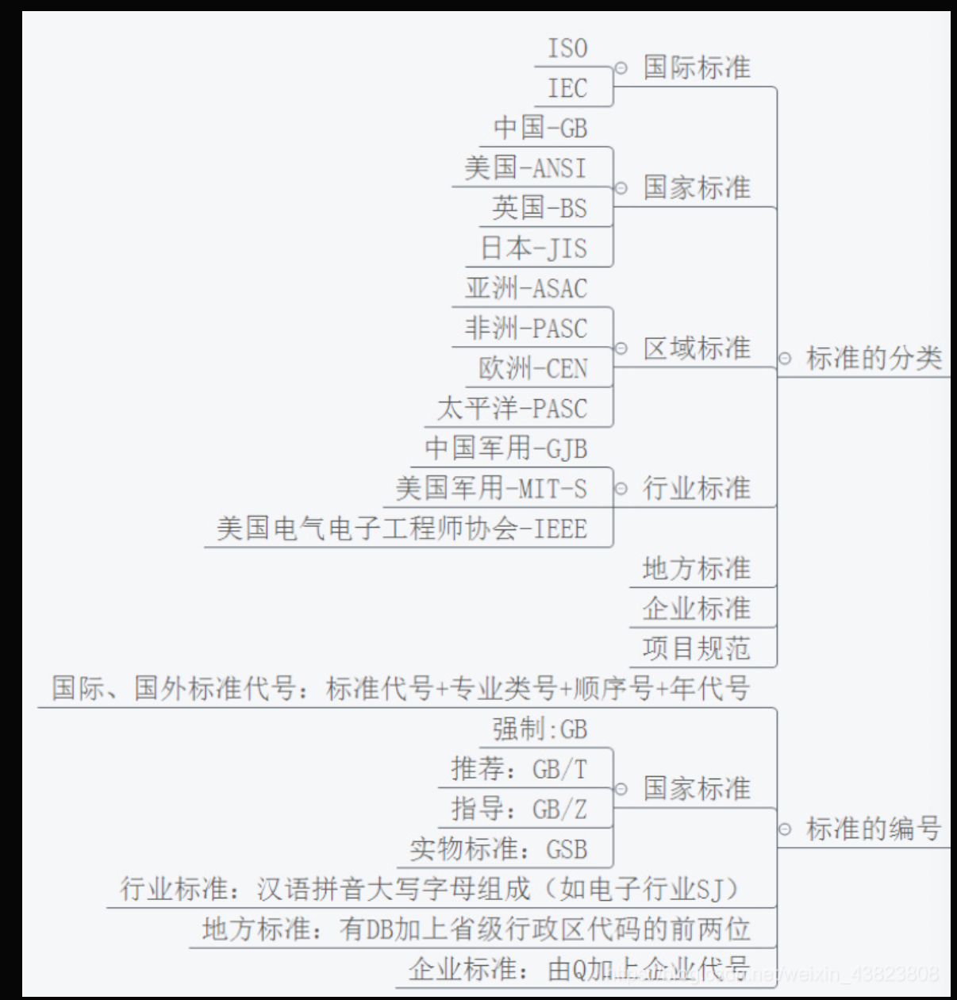

# 1 法律法规知识

## 1.1 知识产权
- 著作权及领接权
- 专利权
- 工业品外观设计权
- 商标权
- 地理标志权
- 集成电路补全设计权
  

设计的法律法规：
- 著作权法
- 计算机软件保护条例
- 商标法
- 专利法

## 1.2 保护期限

## 1.3 知识产权人的确定

### 1.3.1 职务作品

### 1.3.2 委托开发、合作、商标、专利

## 1.4 侵权判定

# 2 标准化基础知识
