# 1 OSI/RM七层模型

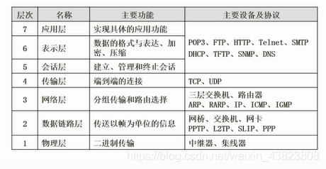

局域网，广域网：同一个局域网内部是可以发送广播，出了局域网就无法接收到。

# 2 TCP/IP协议族（Internet核心协议）
`逻辑遍址，路由选择，域名解析，错误检测，流量控制`

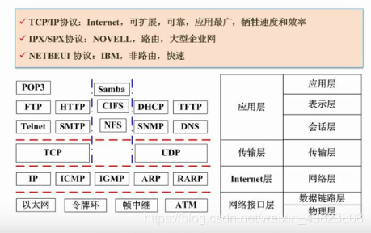

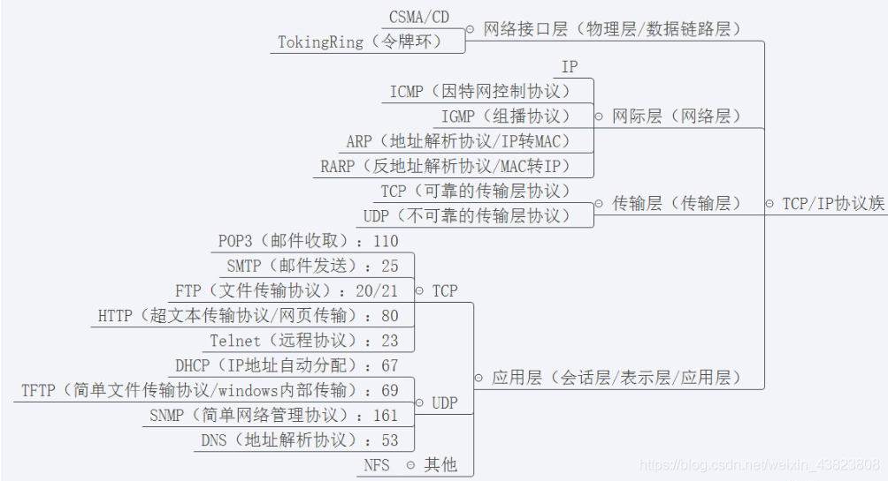

## 2.1 传输层协议

### 2.1.1 ---TCP

TCP在IP提供的不可靠数据服务的基础上为应用程序提供了一个可靠的、面向连接的、全双工的数据传输服务

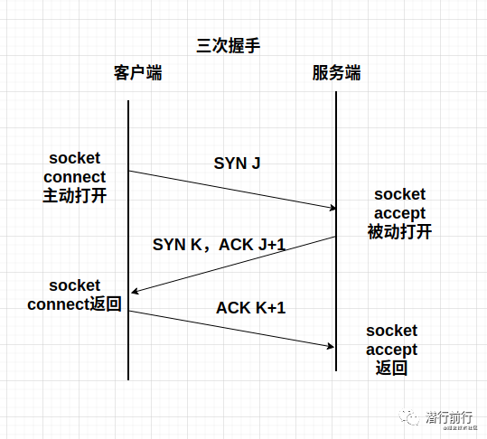
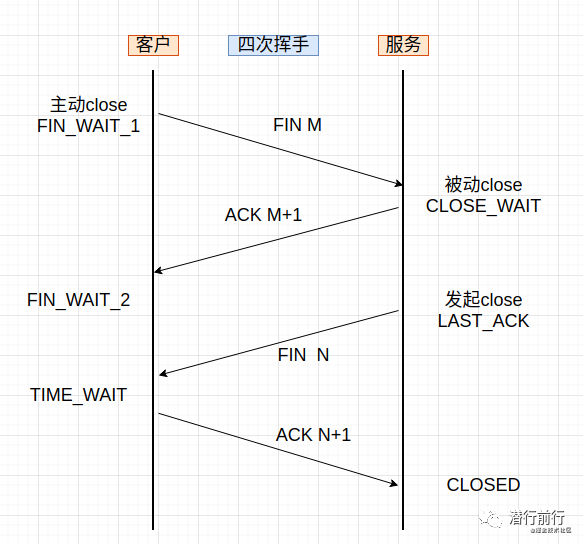

### 2.1.2 --- TCP

UDP是一种不可靠、无连接的协议，可以保证应用程序进程间的通信。

## 2.2 应用层协议

## 2.2.1 --- DHCP
动态主机设置协议是一种使网络管理员能够集中管理和自动分配IP网络地址的通信协议。

## 2.2.2 --- DNS
- `递归查询`
  - 本机向本地域名服务的查询采用
  - 当本地域名服务器没有的时候，由本地域名服务器替代DNS客户端进行查询工作。
  - 我怎么样都要给你提供一个结果。
- `迭代查询`
  - 本地域名服务器像跟域名服务器的查询通常采用，所有查询工作由自身发起查询。
  - 具体表现就是我不一定能知道结果，你可能需要找下一个

## 2.3 网络层协议 
主要作用是实现终端节点之间的通信（点对点通信）
### 2.3.1 --- ARP和RARP

- ARP(地址解析协议）：将IP地址转换为物理地址
- RARP(反地址解析协议)：将物理地址转换为IP地址

### 2.3.2 --- IP 

### 2.3.3 --- ICMP
专门用于发送差错报文的协议。IP在需要发送一个差错报文的时要使用ICMP，而ICMP也是利用IP来传送报文的。ICMP让IP更加稳固、有效的一种协议。它使得IP传送机制变得更加可靠。

# 3 计算机网络分类

## 3.1 按分布范围
- 局域网（LAN）
- 城域网（MAN）
- 广域网（WAN）
- 因特网

## 3.2 按拓扑结构
- 总线型
- 星型
- 环形

# 4 网络协议与规划
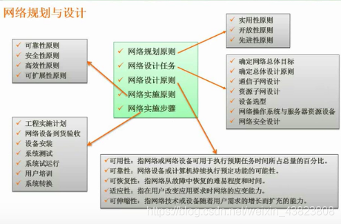

## 4.1 逻辑网络设计
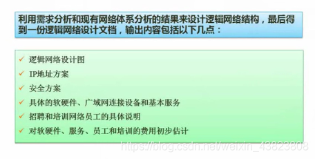

## 4.2 物理网络设计
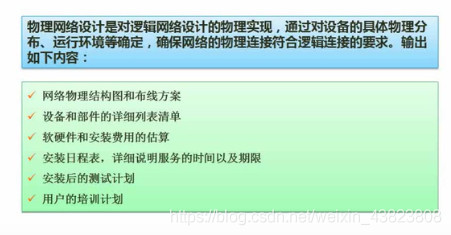

## 4.3 分层设计
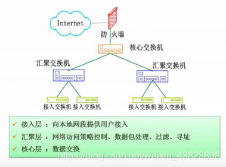

# 5 IP地址

IP地址中，全0代表网络，全1代表广播

# 6 HTML

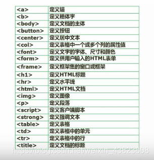

# 7 网络接入技术

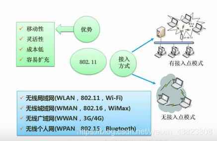
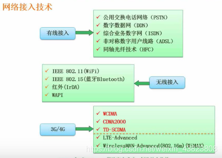

# 8 IPv6
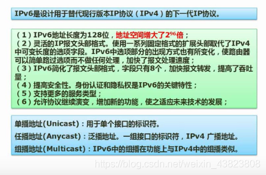

# 9 信息系统安全属性

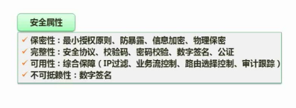

# 10 加密技术

## 10.1 --- 对称加密
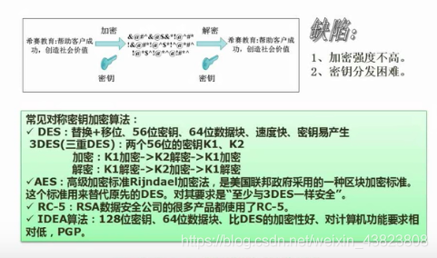

## 10.2 --- 非对称加密
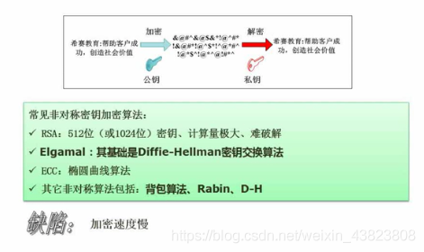

## 10.3 --- 信息摘要
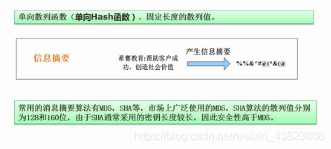

## 10.4 --- 数字签名
校验数据是否被篡改和伪装。
- 发送方（签名生成）：将数据进行哈希（MD5之类的）（得到的东西叫摘要），然后使用发送方的私钥进行加密，得到一个用于校验的东西，这个东西就叫数字签名
- 接收方（签名验证）：将接受到的数据进行哈希处理，然后和接收到的数字签名先进行公钥解密后进行对比。

怎么确定公钥舒服发送方？------数字证书

## 10.5 --- 数字证书与PGP  

### 10.5.1 数字证书
是一种相当于现实世界中身份证的功能在数字信息世界中的实现。数字证书包含了个人或结构的`身份信息`及`公钥`，因此也成为`公钥证书(Public-Key Ceritificate,PKC)` 
类似身份证由公安机构颁发，公钥证书也是由`认证机构(CA)`颁发。

# 11 网络安全

## 11.1 各个网络层次安全保障
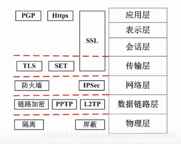

## 11.2 网络威胁与攻击
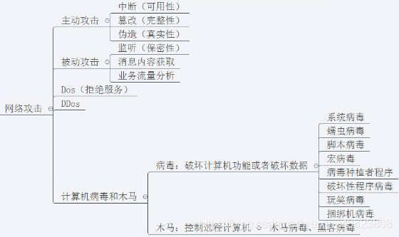
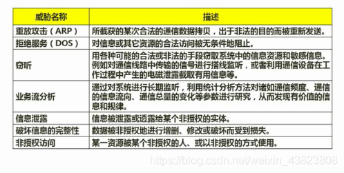
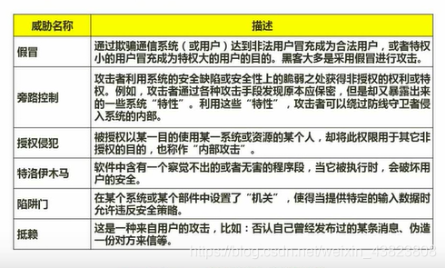

## 11.3 防火墙技术
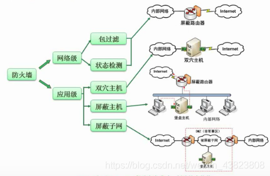
